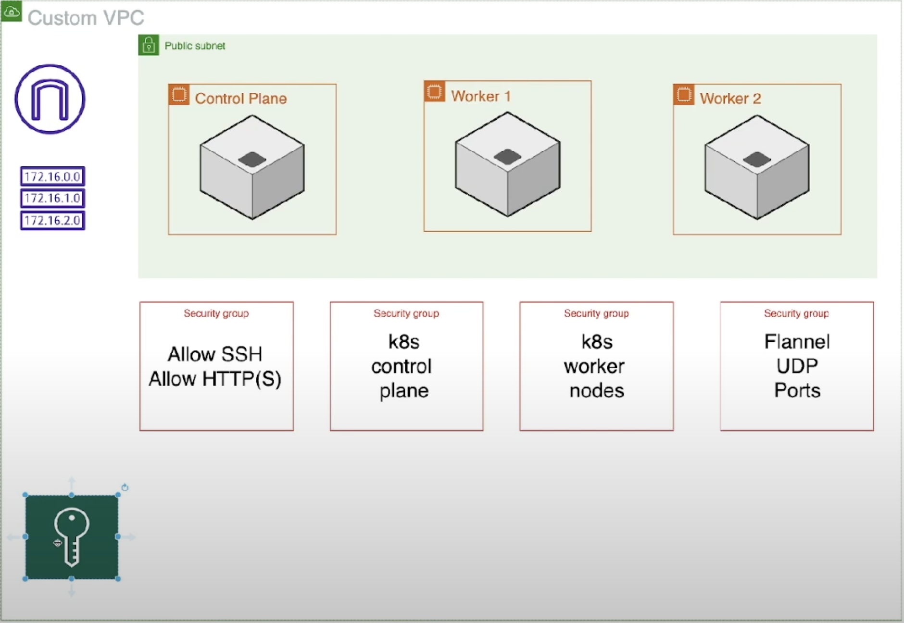

# Game Price Comparator Infrastructure

The Game Price Comparator Infrastructure makes use of docker images published respectively in the [Backend]((https://github.com/kirdreamer/GamePriceComparator)) and [Frontend](https://github.com/derReiskanzler/fe-angular-game-price-comparator) Repository.

## Table Of Contents
1. [Scaffold](#scaffold)
2. [Local Setup with Minikube](#local-setup-with-minikube)
    - [Preparation](#preparation)
    - [Step-by-Step](#step-by-step)
        - [Problems with Minikube on Unix-OS](#problems-with-minikube-on-unix-os)
    - [Stop](#stop)
3. [Local Setup with Terraform and Minikube](#local-setup-with-terraform-and-minikube)
    - [Problems with Minikube on Unix-OS (again)](#problems-with-minikube-on-unix-os-again)
4. [Remote Setup with Terraform, Ansible and Kubeadm](#remote-setup-with-terraform-ansible-and-kubeadm)
    - [Prerequisites](#prerequisites)
    - [Setup](#setup)
    - [Access browser](#access-browser)
    - [References](#references)

## Scaffold
The scaffold consists of a k8-resources, a terraform-local and a terraform-remote directory.
Each of them contain three namespaces representing the number of environments: `develop`, `staging` and `production`. For the k8-resources, each of the environments contain `.yaml`-files that are divided in frontend and backend resources that can be used to spin up a local cluster (↗︎ [Local Setup with Minikube](#local-setup-with-minikube)) or to be copied into a remote machine to spin up a cluster on a remote machine (↗︎ [Remote Setup with Terraform, Ansible and Kubeadm](#remote-setup-with-terraform-ansible-and-kubeadm)).

However there is also a terraform-local directory that itself holds all three environments and contain each the k8-resources again, just as `.tf`-files in order to spin it up via terraform (↗︎ [Local Setup with Terraform and Minikube](#local-setup-with-terraform-and-minikube)).

The terraform remote directory so far contains only the develop environment, as the remote approach does not work yet. The remote approach contains `.tf`-files for spinning up the infrastructure and `.yaml`-files for ansible which provision and manage the infrastructure.

## Local Setup with minikube

In `./[develop,staging,production]/[backend,frontend]` relevant yaml-files can be found.
For the Backend:
   - `postgres.yaml`: contains PersistentVolumeClaim, Deployment and Service for postgres. 
   - `postgres-config.yaml`: contains Configuration for postgres
   - `postgres-secret.yaml.template`: Secrets template for postgres. Requires updating credentials.
   - `backend.yaml`: contains Deployment and Service (LoadBalancer) for Backend service
   - `ingress.yaml`:  contains Ingress for Backend service (Can be ignored as Frontend will take over this responsibility)
   - `image-checker.yaml`: responsible for checking new images of the Backend

### Preparation
To use environment variables for Backend you need to use .env.template as a template: 

- Create `.env` file based on `.env.template`
- Write your URL and credentials to connect database for PostgresDB. By default, URL is "localhost" and port is "5432".
- Add your gmail in MAIL_PROVIDER_USERNAME and App-password from google in MAIL_PROVIDER_PASSWORD: Google-Account -> Security -> 2-Factor Authentication -> App Passwords. To use a different mail provider, you must change the host in spring.mail.host
- Add secret key for jwt. To generate this key you can use such sites like [www.browserling.com](https://www.browserling.com/tools/random-hex)

#### Namespace

If required, create a namespace for each project or environment:
``` bash
kubectl create namespace <environment>
```

And change current context to respective environment:
``` bash
kubectl config set-context --current --namespace=<environment>
``` 

You need to run commands with namespace flag accordingly e.g.:
``` bash
kubectl apply -f ./postgres.yaml -n <environment>
``` 

### Step-by-Step

1. [Download](https://minikube.sigs.k8s.io/docs/start/?arch=%2Fmacos%2Farm64%2Fstable%2Fbinary+download) minikube and start cluster:
``` bash
minikube start \
    --cpus=2 --memory=3920m \
    --container-runtime=cri-o \
    --driver=docker \
    --addons=ingress
```

2. Watch pods, services & ingress (run in seprate terminals).
``` bash
watch --exec kubectl get pods --output wide
watch --exec kubectl get services --output wide
watch --exec kubectl get ingress --output wide
```

3. Apply Configurations and Secrets:
``` bash
kubectl apply -f ./<environment>/backend/postgres-config.yaml
# After creating yaml-file with your credentials
kubectl apply -f ./<environment>/backend/postgres-secret.yaml
# To be able to use secrets from .env you need to create them
kubectl create secret generic be-java-game-price-comparator-<environment>-secret --from-env-file=.env
```

4. Start Postgres and Backend:

``` bash
kubectl apply -f ./<environment>/backend/postgres.yaml
kubectl apply -f ./<environment>/backend/backend.yaml
kubectl apply -f ./<environment>/backend/ingress.yaml
# Or for whole directory
kubectl apply -f ./<environment>/backend
```

5. Start all or specific K8-ressources for Frontend:
``` bash
# Whole directory
kubectl apply -f ./<environment>/frontend

# Specific file
kubectl apply -f ./<environment>/frontend/<K8-ressource>
```

If there are problems, try:
``` bash
# checking pods if they haven't been created
kubectl describe pod

# or if they are created and have an error in the status
kubectl logs <pod-name>
```

6. To enable image-checking (CronJob) for Frontend and/or Backend:

``` bash
kubectl apply -f ./<environment>/[backend,frontend]/image-check.yaml
```

#### Problems with Minikube on Unix-OS

7. As per the [K8 doc](https://kubernetes.io/docs/tasks/access-application-cluster/ingress-minikube/#create-an-ingress), we are using Docker on a Unix-OS (Darwin), thus we need to create a tunnel to our cluster to make it accessible from outside.
``` bash
minikube tunnel
```

8. Test from terminal if html is returned
``` bash
# Should return HTML of Angular app
curl --resolve "fe-angular-game-price-comparator-develop.nip.io:80:127.0.0.1" -i http://fe-angular-game-price-comparator-develop.nip.io
```

Optionally you add the Frontend ingress host to `/etc/hosts` and checkout the browser:
```
127.0.0.1 fe-angular-game-price-comparator.<environment>.nip.io
```

9. Test if Backend service is reachable:
``` bash
# Get exposed service url of cluster
minikube service be-java-game-price-comparator-<environment>-service --url

# send backend api call - should return Ok as a string
curl <service-url>/api/v1/health
```

### Stop

Stop/Delete cluster:
``` bash
minikube stop
minikube delete
```


Delete ressources:
``` bash
kubectl delete all --all
# Or
kubectl delete --all ingresses
kubectl delete --all services
kubectl delete --all deployments
kubectl delete --all secrets
kubectl delete --all configmaps

# Specific ressources
kubectl delete [configmap,ingress,service,pod] <name>
```

## Local Setup with Terraform and Minikube

This setup is bascially the same as the setup before as it still uses `minikube`, just with terraform to allocate k8-resources at once instead of single-handedly applying resources in a specific order.

Start minikube:
``` bash
minikube start \
    --cpus=2 --memory=3920m \
    --container-runtime=cri-o \
    --driver=docker \
    --addons=ingress
```

Create `.env` in `./terraform/<environment>` using the `.env.template`.

Watch apply/creation of pods
```bash
watch --exec kubectl get pods --output wide
```

Spin up terraform:
``` bash
# cd into ./terraform/<environment>
terraform init
terraform apply
```

Delete ressources:
``` bash
terraform destroy
```

### Problems with Minikube on Unix-OS (again)

As we are using a local cluster again and described in the 7. step of [Setup](#setup), when using Docker on Darwin, the URLs of the ingresses cannot be accessed from outside the cluster.

To access the Frontend URL locally in the browser, run:
```bash
minikube tunnel
```

To be CORS compliant with the Backend, we need to get the URL of the exposed Frontend load balancer service and add it as an environment variable to our Backend:
```bash
# Get exposed service url of cluster
minikube service be-java-game-price-comparator-<environment>-service --url
minikube service fe-angular-game-price-comparator-<environment>-service --url
```

Add in `backend-deployment.tf`:
```
env {
    name  = "FRONTEND_URL"
    value = "<frontend-service-url>/api"
}
```

Same for `frontend-deployment.tf`:
```
env {
    name  = "API_BASE_URL"
    value = "<backend-service-url>/api"
}
```

Reapply change:
```bash
terraform apply
```

The frontend should now be available from the browser using the `frontend-service-url` and its respective port.

### Remote Setup with Terraform, Ansible and Kubeadm
We followed [this tutorial](https://www.youtube.com/watch?v=Cr6oLkCAwiA) to set up an unmanaged K8-Cluster.

The setup is on this branch: `feature/refactor-infra-into-cluster-with-ansible`.
As of now the ingress doesnt work. There is an ingress-nginx-controller installed (see `/terraform/<environment>/playbook.yaml`), but there is still an issue with the configuration.



<strong>Fig. 1: Architecture diagramm</strong>


#### Prerequisites

Make sure you:
- [install](https://docs.ansible.com/ansible/latest/installation_guide/intro_installation.html) Ansible
- a ssh key-pair named `operator` in `/terraform/<environment>/.ssh`
- checkout following branch: `feature/refactor-infra-into-cluster-with-ansible`

#### Setup

Run script to set it up in one go or do it step by step by following the same steps in the script:
```bash
cd ./terraform/<environment>

./provision.sh
```

The script within contains more details on what exactly is executed.

Try to ssh into the control plane:
```bash
ssh -i .ssh/operator -l ubuntu $(terraform output -raw 'control_plane_ipv4')
```

#### Access browser
```bash
# Get ip addresses of worker_nodes
terraform output 'worker_nodes_ipv4'
# Expected Output:
# [
#   "<ip_worker_node_0>",
#   "<ip_worker_node-1>>",
# ]
```

Use any `ip_worker_node` along with the frontend load balancer service target port for http that has been printed in the `provision.sh` script when `kubectl get all --all-namespaces` was executed. Then use to access the frontend in the browser:
```bash
http://<ip_worker_node>:<target_port_frontend_load_balancer_service>
```

As of now the ingress doesnt work, which makes it not possible for the frontend to interact with the backend.
